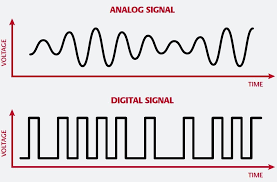

# Basic Electronics
- Analog
- Digital

## Binary Code and digital signals
- Modern computers use binary digital input (usually binary) to represent all information
- Binary code has two values, 1 representing on/high, and 0 representing off/low
- On is usually 3 or 5 volts while off is usually 0 volts
- Analog devices allow for any value within a given range but are succeptible to noise, binary systems are not greatly affected by noise

## Analog signals
- Analog signals have a continuously changing value and are used ot represent continuous data
- Examples include:
    - Temperature
    - Acceleration
    - Humidity
    - Light Intensity
    - Sound Level
- Examples of digital/discreet signals include:
    - Switch
    - Keyboard switch

## Sensors
- Analog sensors measure analog data, digital sensors measure digital data
- Analog sensors give analog voltage as an output. The output voltage may be anywhere in the range of 0V to 5V (not limited to)
- Analog sensors would include:
    - Thermometers
    - Pressure sensors
    - Light intensity sensors
- Digital sensors would include:
    - Proximity sensors, IR sensor, digital temperature sensor and digital humidity sensor

- A digital sensor consists of 3 components:
    - Sensor
    - Cable
    - Transmitter

- In digital sensors, the signal measured is directly converted into digital signal output through the digital sensor itself. And this signal is transmitted through cable digitaly.

- The signal measure may be analog but the output from the sensor is digital

## Electricity and elecrons
- The CPU Memory, Bus and other components are all electrical devices that control the flow of electicity

- An electric circuit is a closed loop of conductive material that allows current to flow when there is a potential difference between two points in the path

- if the circuit is not closed it is said to be open, electricity cannot flow. A switch is used to break an electric circuit.

## Electric Current
- The flow of electrons from one place to another is called current
- the greater the number of electrons that pass through a given point in a given unit of time, the stronger the current is said to be.
- The unit of current is the Ampere. It is measured using an Am-metre or a multi-meter set to measure Amps.

## Voltage
- Voltage is the difference in electric potential between two parts of an electric circuit
- This potential difference causes electrons to move around the circuit
- The unit of voltage is the volt
- Voltage is measured using a voltmeter or a multi-meter set to measure voltage

## Resistance
- Resistance is a measure of how much a material resists the flow of electric current. The excess current is generally lost as heat.
- When the resistor consumes energy is causes a drop in electric potential or a voltage drop in the circuit.
- Gold and copper have very low resistance
- Glass has a very high resistance

- If a material has a very high resistance to the flow of electrons it is called an **insulator**
- If a material has a very low resistance it is called a **conductor**
- An electric kettle makes use of this to heat water
- The unit of resistance is the Ohm
- Resistance is measured using an Ohmmeter of a mulit-meter set to measure Ohms

|Quantity|Symbol|Unit|Abbreviation|
|---|---|---|---|
|Current|1|Ampere(Amp)|A|
|Voltage|E or V|Volt|V|
|Resistance|R|Ohm|Ω|