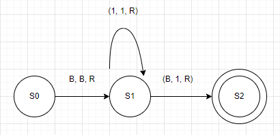

# Turing Machines
## Introduction
- The Turing Machine (TM) was invented in 1936 by *Alan Turing*.

- It is a basic abstract symbol-manipulating device that can be used to simulatethe logic of any computer that could possibly be constructed.

- Although it was not actally constructed by Turing, it's theory yielded many insights.

- A Turing Machine consists of 3 components:
    1. An infinitley long tape made up of individual cells. Each cell can contain a single character - typically 1, 0, or B(Blank)
    
    2. A read/write head pointed at an individual cell.

    3. A controller (aka finite-state machine) which instructs the read/write head what to do.

- Anything that is possible to (mathematically) compute could be programmed on a Turing Machine.

## Operation

- initially the tape is inscribed with a sequence of characters, the input.

- The operation of the Turing Machine is controlled by the finite- state machine (controller)

- The operation takes place as a sequence of steps known as transitions.

- the controller decides for a given (input, character, state) pair, (output character state) pair - known as a transition.

- each transition involves:
    - Reading
    - Writing
    - Moving
    - Updating (state)

- Transitions can be expressed in the following ways:

    - state transition diagram   
    

    - state transition table   
    ![Example of a state transition table](data:image/png;base64,iVBORw0KGgoAAAANSUhEUgAAARsAAACJCAMAAAArKmzvAAAABlBMVEX///8AAABVwtN+AAAF3ElEQVR4nO1ci3bjKgy0/v+n77kNmOfoAdiBrLSn7cZihJgIWahOr8vFxcXlZSGXKC03k9QO4+xIC2LAL+fGAnFuMKS68v+2m/EBbd0Wl435m/QPFaFdA8N+/RkVvZK4oWhJPW2rJM0qyneAym9dyzNxQ+0l+XV3pTPcyPA46FVuqAMf4uZj6+8r/IvG87CH/lLhz2d0E4stNxQDLkxKTQzPxE0M5mi1s/OV3EQfKfhI8VWzYSA3NaRxpDYT/f9MGl0o0lI7F5RmT1FukDoeGbmJP2KibLzl4yaDdN4kal5S2laUz8vMBQVxEwxq9hjKNzU3t9YWN11IUKu4EZzH0iKLnDPATU5GvJsnV+//8e9lwY1yTyVWimkW7qmK83odXfO1z7HAiPkw5cT4SsiPyUKwEczV0yJuimnW5GJKMZNyceOTyI1VBDhUn1gXzxvUqZ0bXKc7NxzOucE45wbjDuXG0Kio7sT3TR8bj5ri7qzqbNyFW6oSdH7p1qPi5i5ouEF9TVlvsr5XlUtbHuK5Ug2m8ku5HjU31wpu1HHDDm2HxILdwI1iPdo99fmeV8TgbULcxCNd7HbUaMQN19noc3P3C+meq/ZLtx5tLr6L7BTt/aCvL1HxLlFtpB5XG6IPMQQwBbg+7hWQ2rpiPVpuEjS1GrqpD3CTjjDxR4XGccNhct/SuJwp2HCW12PONwXPHTHETW9cbYgNUw03Pb+U69Fxcxu5e3HJFwmerzGiqUXz3Ih7quWmYKDiRrceZdxkyYr6/QIIT3sjZccOuulRKDoblI+le98Wu6iXi5XrUXFjkVG4+gY8ONeAX86NBbIhN+gs8D43X5KvTYxlBcE/Kh43jCjYmiRbi7MjPRevmetpboiqQtzmQy9KMxxUmhRoEjSWLBDmVnpdqcXADWLgjBbp8HRdhb4WCuuBflm5mYibUW6MChs3ndMWA2E3hTjkJG6yiJznJlr7FW5udubzza3+HW6KjSVD/sF8o4ZwRz7elgQXtCu5US0r69IuuE9R0TwCg7BqrL7BMFCzdAHdSxR+ydCfwZxvJBmFn14XP+RDwDk3GHcCN18S71EwuBPixm5kBdy54XBnc0Nz/RtBt6T2A4kC1kIX4QLKemaY6N9IOFz7WeZC5yNwaZP+zStxY+UmXJ+vi+f6N9txkyJyfk/d1rbmxpBv7vUs4eaIPaXcIPn1fyffKONmZb6Z7N/sx00auyBuaPv+TfRQNTb1b5TmhXwjySj89Lr4IR8CzrnBuBO4+ZJ4/4bBnRA3diMr4M4NhzubG+L7HRo4g1tS+4FEAc9eXC1rPTOI3S0Bzmhx7WeZi4ACXOL6UUPnqXe5sZ8ZDNysihvpeRWFZitupH6UMRezz6sIqpe4MeSbi+9Hme9TnDFe9VrcdMfDbIZ1Q/mGo28DbvBe61xaxU2wg94aCS5o3+cmjl0SN8Q+ryLAd+3fLPn9lEpG4afXxQ/5EHDODcadwM2XxPs3DO6EuLEbWQF3bjjc2dzQXP9G0C07T5nGMuuxnhkm+jfvPH+jL3LF9Qydpwa5eSVujNxw6zHuKXnQQdw88vkplj8Ozere50ZYj/k+RcKYs7hh1zOUb8bXz+m+l2/UEIabYIf2zzeqZT3w+an+UUOG++enRuGn18UP+RBwzg3GncDNl8T7NwzuhLixG1kBd2443Nnc0G8+f4P8sp4ZfvD5G+jX0HnqXW5sCiM33HqMe0oxhtVsxc0zf/9mZ24M+eZ6on+z955SBkF2fU0uPoEbvNc6lxivTNwkO7/BTRirDzXWffbzRgJ81+dvUIay5xtJRuGn18UP+RBwzg3GncDNl8T7NwzuhLixG1kBd2443Nnc0P7P34BEAc9e3HqsZ4btn79B5yNwaZP+zStxY+XmWsTNZP9mO26yTwitODPM9G9e4saQbz4rWcXNEXtKudB83n8n3yjjZmW+mezf7McNXQvjhn6xf+Ofnxrwy7mxQJwbDHm5R7Kz2Ol0cXFxmZP/AP/fEmWUjKN0AAAAAElFTkSuQmCC)

- The above state transition table and diagram shows a singular transition which says:
    - figure it out yourself

- The output is the sequence of characters left on the tape when the Turing Machine halts.

## States

- At any given time, a TM is said to be in a particular state. States are usually denoted by the letter S followed by a number (ex. S2) is taken to mean state 2.

- S0 is conventionally used to denote the initial state. This is the state the TM is in before it starts to operate.

- A double circle is used to denote the final or **halting** state. This is the state the TM is in when it finishes.

- For example:                    
    

## Significance
- Earlier we asked the question: *How do we define computability?*

- Now we can provide the answer: *A task is computable if it can be carried out by a Turing Machine*

